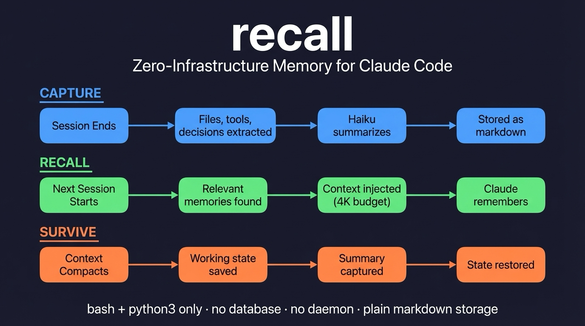
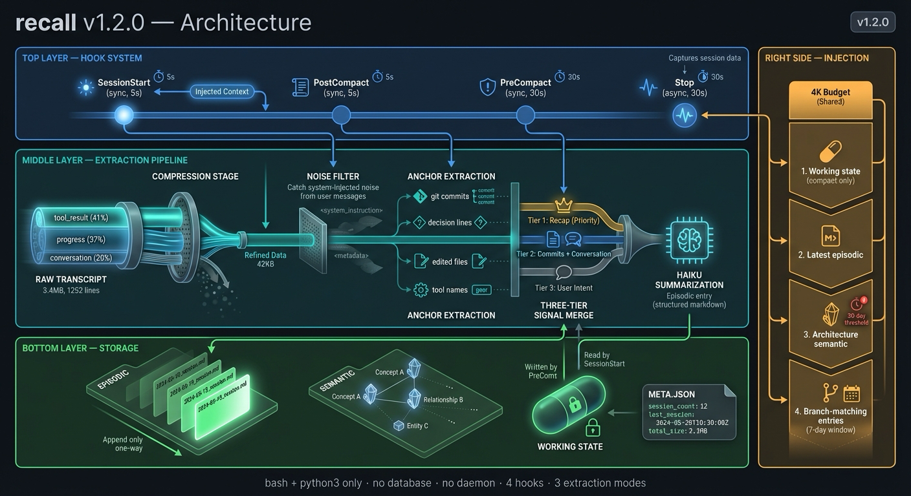

# recall

Zero-infrastructure memory for Claude Code. Captures session knowledge as markdown, injects relevant context on startup, survives compaction.



## Why recall?

Claude Code sessions are ephemeral. When a session ends or context compacts, everything you discussed is gone. `recall` fixes this with 4 lightweight hooks that capture and restore knowledge automatically.

**No database. No daemon. No dependencies beyond bash + python3.**

## Installation

```bash
claude plugin add /path/to/recall
# or from marketplace:
claude plugin add flight505/recall
```

## How It Works

1. **Session ends** — The Stop hook compresses the transcript by stripping mechanical overhead (tool outputs, progress events, system metadata), preserving the full conversational narrative. Git commits anchor the summary as ground truth. Haiku produces a structured episodic entry.

2. **Next session starts** — The SessionStart hook reads recent episodic entries, semantic facts, and branch-matching history, then injects the most relevant context (up to 4K chars) via `additionalContext`.

3. **Context compacts** — PreCompact saves a working-state snapshot before context is lost. PostCompact logs the event and captures Claude's compaction summary. SessionStart restores working state when `source=compact`.

## Anchored Compression

The core of recall's capture quality. Instead of extracting fragments from transcripts, recall compresses the entire conversation:

```
Raw transcript (3.4 MB, 1252 lines)
    │
    ▼ Strip: tool_result content, progress events, system entries, file-history
    ▼ Filter: system-injected noise from user messages
    ▼ Keep: user text + assistant text + [ToolName: file_path] references
    │
Compressed narrative (42 KB, ~330 lines) — 98.8% reduction
    │
    ▼ Anchor: git commits, decision lines, edited files (structured, never lost)
    ▼ Enrich: git log from the session timeframe
    │
Haiku prompt (anchors + full narrative + git log)
    │
    ▼ Single haiku call (~12K input tokens)
    │
Episodic entry (### HH:MM — summary with Goal, Outcome, Key files, Decisions, Open)
```

**Three-tier signal priority:**

| Tier | Source | Quality |
|------|--------|---------|
| 1 | Claude's session recap (from CLAUDE.md instruction) | Highest — Claude wrote it with full context |
| 2 | Git commits + compressed conversation | High — artifacts are ground truth |
| 3 | User messages (noise-filtered) | Context — intent, not outcomes |

**Tested against ground truth:** Anchored compression scores 7/10 on session event coverage vs 0-1.5/10 for user-message-only approaches. Resilient to vague user prompts — git commits and assistant narrative carry the signal.

## CLAUDE.md Integration

For best results, add this to your global `~/.claude/CLAUDE.md`:

```markdown
### Session Close (for recall)

When a session is ending, include a brief session recap:

**Session:** <one-line summary>
**Files:** <key files changed>
**Decisions:** <notable choices, or "None">
**Open:** <unfinished work, or "None">
```

When Claude follows this instruction, recall captures it as the highest-priority signal — better than any automated extraction.

## Memory Types

| Type | Location | Strategy | Purpose |
|------|----------|----------|---------|
| Episodic | `episodic/YYYY-MM-DD.md` | Append-only | Session logs — what happened, when |
| Semantic | `semantic/*.md` | Overwrite | Codebase facts — architecture, patterns |
| Working State | `working-state.md` | Overwrite | Pre-compaction snapshot — survives context loss |

## On-Demand Retrieval

Ask about past sessions using the recall skill:

```
/recall what did I work on yesterday?
/recall what decisions were made about the auth system?
/recall what files did I change on the feature/payments branch?
```

A subagent searches your memory files and returns a synthesized answer.

## Architecture



### Injection Budget

SessionStart injects up to **4000 characters** (~1000 tokens, <0.5% of a 200K context window) with this priority:

1. Working state (only after compaction)
2. Latest episodic entry
3. Architecture semantic file (with 30-day staleness warning)
4. Branch-matching episodic entries (last 7 days)

## Storage

All data lives at `${CLAUDE_PLUGIN_DATA}/projects/<project-hash>/` where the hash is the first 12 chars of SHA-256 of your working directory. Files are plain markdown — human-readable, git-friendly, grep-able.

## Hook Events

| Hook | Event | Sync/Async | Timeout | What it does |
|------|-------|-----------|---------|-------------|
| `session-start.sh` | SessionStart | sync | 5s | Inject recalled memories (4K budget) |
| `stop.sh` | Stop | async | 30s | Compress + summarize session |
| `pre-compact.sh` | PreCompact | sync | 30s | Save working state |
| `post-compact.sh` | PostCompact | sync | 5s | Log event + capture compact_summary |

## recall vs Auto-Dream

Claude Code recently introduced **auto-dream** — a built-in memory consolidation feature that reorganizes auto-memory files (`~/.claude/projects/<project>/memory/`). recall and auto-dream are **complementary, not competing:**

| | Auto-dream (built-in) | recall |
|---|---|---|
| **Purpose** | Consolidate Claude's auto-memory notes | Capture session-level episodic history |
| **Storage** | `~/.claude/projects/<project>/memory/` | `${CLAUDE_PLUGIN_DATA}/projects/<hash>/` |
| **Trigger** | Background, automatic | Session end (Stop hook) |
| **Compaction protection** | No | Yes (PreCompact + PostCompact) |
| **Consolidation** | Yes — reorganizes memory files | Episodic logs (append-only) |
| **What it captures** | Learnings Claude decides to keep | Full session narrative via anchored compression |

Auto-dream consolidates *what Claude remembers*. Recall captures *what happened* — the session timeline, files changed, decisions made, and open work. They write to different storage paths and serve different purposes. Both can run simultaneously.

## Configuration

No configuration needed. recall uses `${CLAUDE_PLUGIN_DATA}` (set by Claude Code) for storage, falling back to `~/.recall` if unset.

## License

MIT
